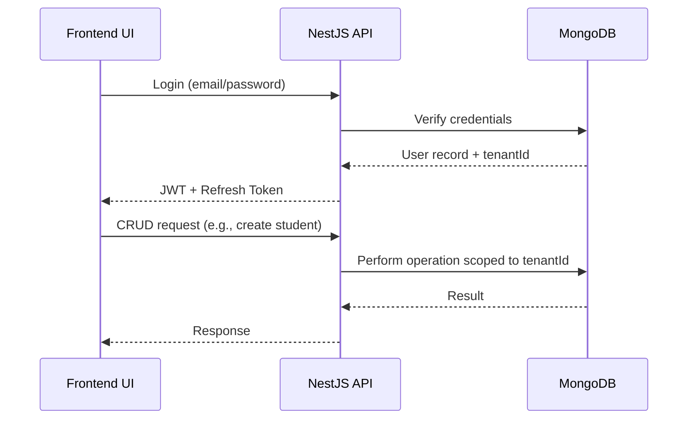
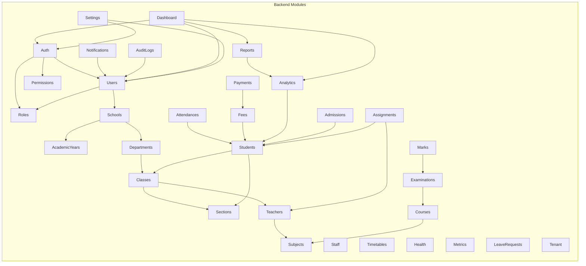

# High-Level Design (HLD)

## 1. System Overview
The School Management System follows a **decoupled client‑server architecture**:
- **Frontend** – React + Vite + TypeScript, using Material‑UI (MUI) with a custom Soft‑UI theme.
- **Backend** – NestJS (TypeScript) with a modular structure (Controller‑Service‑Repository).
- **Database** – MongoDB accessed via Mongoose, supporting multi‑tenant isolation via a custom `tenantPlugin`.
- **Authentication** – JWT (RS256) with NestJS guards for RBAC.
- **API Documentation** – Swagger UI auto‑generated.
- **Observability** – Sentry integration, audit logs, health checks, metrics.

## 2. Architecture Diagram
```mermaid
graph TD
    A[Client Browser] --> B[React Frontend]
    B --> C[Axios API Layer]
    C --> D[NestJS API Gateway]
    D --> E[Auth Guard (JWT/RBAC)]
    D --> F[Business Modules]
    F --> G[MongoDB (Tenant‑aware)]
    D --> H[Swagger UI]
    D --> I[Sentry]
    D --> J[Metrics & Health]
```

## 3. Logical Architecture (Modules)
| Layer | Description |
|-------|-------------|
| **Presentation** | React components, routes, context providers, MUI theme. |
| **API Layer** | Axios services per feature, React‑Query for caching. |
| **Backend** | NestJS modules (Auth, Users, Roles, Permissions, Schools, AcademicYears, Departments, Classes, Sections, Teachers, Courses, Subjects, Staff, Students, Timetables, Attendances, Examinations, Marks, Fees, Payments, Notifications, Analytics, Reports, AuditLogs, Dashboard, Health, Metrics, LeaveRequests, Admissions, Assignments, Settings, Tenant). |
| **Data** | MongoDB collections per module, with indexes on `tenantId`, `email`, `studentId`, etc. |
| **Cross‑cutting** | Sentry (error tracking), Throttler (rate limiting), Logging, Audit interceptor, Tenant interceptor/guard. |

## 4. Deployment Diagram
```mermaid
flowchart LR
    subgraph Frontend
        FE[React SPA] --> CDN[CDN (static assets)]
    end
    subgraph Backend
        API[NestJS Server]
        DB[(MongoDB Atlas)]
        Sentry[Sentry]
        API --> DB
        API --> Sentry
    end
    CDN -->|HTTPS| API
    User[User Browser] -->|HTTPS| CDN
```

## 5. Security Architecture
- JWT authentication with short‑lived access tokens.
- RBAC enforced via NestJS `RolesGuard`.
- Rate limiting via `ThrottlerModule` (default, sensitive, exports).
- Input validation using DTOs + `class-validator`.
- Audit logging of privileged actions.
- TLS enforced at load balancer (AWS/GCP).

## 6. High‑Level Data Flow


## 7. Non‑Functional Concerns
- **Scalability**: Horizontal scaling of API containers; MongoDB sharding.
- **Availability**: Deploy across multiple AZs with health checks.
- **Observability**: Centralised logs (structured JSON), metrics (Prometheus compatible), Sentry alerts.
- **Performance**: Caching via React‑Query, DB indexes, rate‑limited endpoints.

---
*All mockup screenshots referenced in the UI sections are stored under `docs/` and can be linked directly from the frontend design documents.*

---
## 8. Extended Architecture Diagram (Modules)


```
