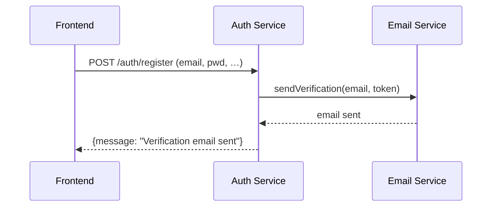
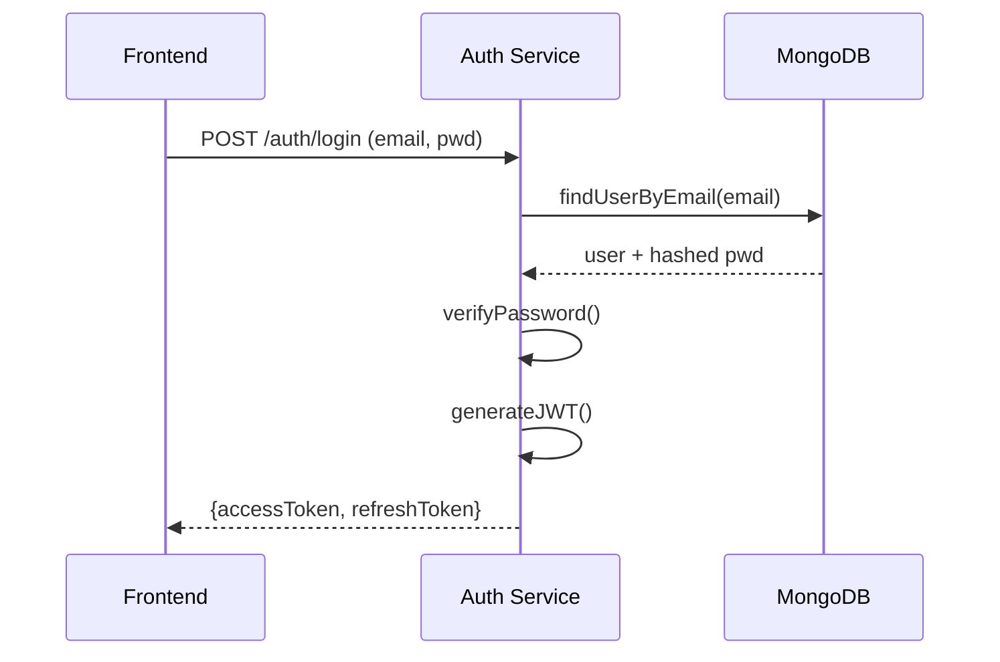
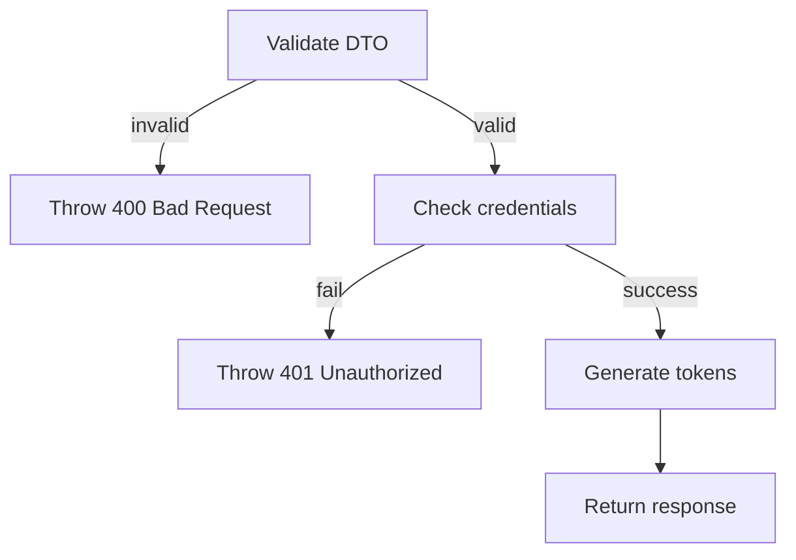
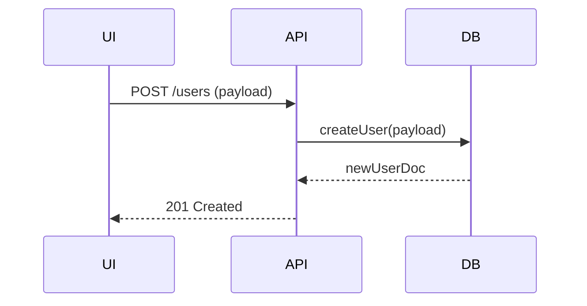
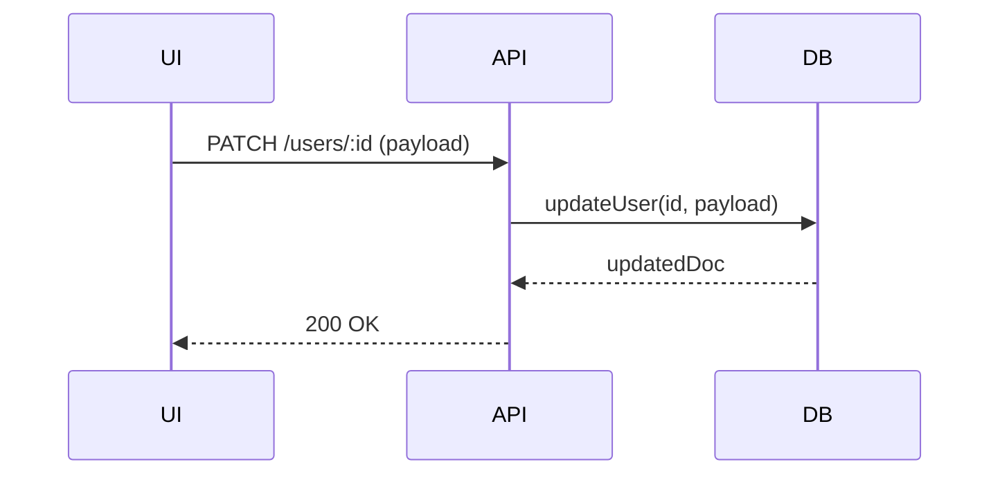
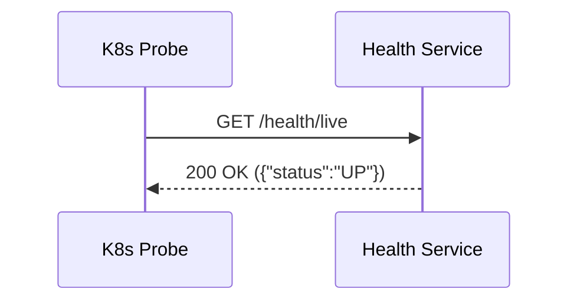

# Low‑Level Design (LLD)

## 1. Module Overview & Responsibilities

| Module | Primary Responsibility |
|--------|------------------------|
| **Auth** | JWT issuance, refresh, password hashing, login/logout endpoints. |
| **Users** | User CRUD, role assignment, profile management. |
| **Roles** | Definition of system roles, role CRUD, association with permissions. |
| **Permissions** | Fine‑grained permission definitions, linking permissions to roles. |
| **Tenant** | Multi‑tenant isolation, tenant context propagation via guards & interceptors. |
| **Schools** | School entity management (name, address, settings). |
| **AcademicYears** | Academic year periods, activation status. |
| **Departments** | Department hierarchy within a school. |
| **Classes** | Class groups (grade, section) linked to departments and teachers. |
| **Sections** | Section subdivisions of a class (e.g., A, B). |
| **Teachers** | Teacher profile, subjects taught, class assignments. |
| **Students** | Student enrollment, personal details, class/section linkage. |
| **Courses** | Curriculum courses, credit information. |
| **Subjects** | Subject definitions, mapping to courses and teachers. |
| **Timetables** | Scheduling of classes/sections with rooms and teachers. |
| **Attendances** | Daily attendance records per student per class. |
| **Examinations** | Exam definitions, schedules, grading schemes. |
| **Marks** | Storage of exam results, calculation of aggregates. |
| **Fees** | Fee structures, due dates, amount calculations. |
| **Payments** | Payment processing, receipt generation, status tracking. |
| **Notifications** | Email/SMS/Push notifications for events. |
| **Analytics** | Aggregated metrics, charts, dashboards. |
| **Reports** | Exportable reports (PDF/CSV) for admin use. |
| **AuditLogs** | Immutable audit trail of privileged actions. |
| **Dashboard** | Summary widgets for admin and user dashboards. |
| **Health** | Liveness/readiness probes for Kubernetes. |
| **Metrics** | Prometheus metrics endpoint. |
| **LeaveRequests** | Staff/teacher leave request workflow. |
| **Admissions** | Student admission process and status tracking. |
| **Assignments** | Assignment creation, submission, grading. |
| **Settings** | System‑wide configuration values. |
| **Parents** | Parent portal access, student‑parent linking. |
| **Staff** | Staff profile and role management. |
| **Common** | Shared utilities, constants, and helper functions. |

---

## 2. Detailed Module Specification (repeated for each module)

### 2.1 Auth Module
#### Internal Components
- **Controller**: [`auth.controller.ts`](file:///Users/shyamlal/Desktop/ai-coding/student-management/backend/src/auth/auth.controller.ts)
- **Service**: [`auth.service.ts`](file:///Users/shyamlal/Desktop/ai-coding/student-management/backend/src/auth/auth.service.ts)
- **DTOs**: `login.dto.ts`, `register.dto.ts`
- **Guards**: `JwtAuthGuard`, `RolesGuard`
- **Interceptors**: `LoggingInterceptor`
- **Schema**: Uses `User` schema from `users` module.

#### Sample DTOs
```typescript
export class LoginDto {
  @IsEmail()
  email: string;

  @IsString()
  @Length(8, 32)
  password: string;
}

export class RegisterDto {
  @IsEmail()
  email: string;

  @IsString()
  @Length(8, 32)
  password: string;

  @IsString()
  firstName: string;

  @IsString()
  lastName: string;
}
```
#### API Endpoints
| Method | Path | Description | Required Role |
|--------|------|-------------|---------------|
| **POST** | `/api/auth/login` | Validate credentials, return JWT & refresh token. | Public |
| **POST** | `/api/auth/register` | Register new user, send verification email. | Public |
| **POST** | `/api/auth/refresh` | Refresh access token. | Refresh token |
| **POST** | `/api/auth/logout` | Invalidate refresh token. | Authenticated |

#### Create Flow (Register)

#### Login Flow

#### Error Flow (validation & auth failures)

---

### 2.2 Users Module
#### Internal Components
- **Controller**: [`users.controller.ts`](file:///Users/shyamlal/Desktop/ai-coding/student-management/backend/src/users/users.controller.ts)
- **Service**: [`users.service.ts`](file:///Users/shyamlal/Desktop/ai-coding/student-management/backend/src/users/users.service.ts)
- **Schema**: [`user.schema.ts`](file:///Users/shyamlal/Desktop/ai-coding/student-management/backend/src/users/schemas/user.schema.ts)
- **DTOs**: `create-user.dto.ts`, `update-user.dto.ts`
- **Guards**: `RolesGuard` (ADMIN for CRUD)

#### Sample Schema
```typescript
@Schema({ timestamps: true })
export class User {
  @Prop({ required: true, unique: true })
  email: string;

  @Prop({ required: true })
  passwordHash: string;

  @Prop({ type: Types.ObjectId, ref: 'Role' })
  role: Role;

  @Prop({ default: true })
  isActive: boolean;
}
```
#### API Endpoints
| Method | Path | Description | Role |
|--------|------|-------------|------|
| GET | `/api/users` | List users (paged). | ADMIN |
| POST | `/api/users` | Create user. | ADMIN |
| GET | `/api/users/:id` | Get single user. | ADMIN |
| PATCH | `/api/users/:id` | Update user. | ADMIN |
| DELETE | `/api/users/:id` | Delete user. | ADMIN |

#### Create Flow

#### Update Flow

---

### 2.3 Roles Module
#### Internal Components
- **Controller**: [`roles.controller.ts`](file:///Users/shyamlal/Desktop/ai-coding/student-management/backend/src/roles/roles.controller.ts)
- **Service**: [`roles.service.ts`](file:///Users/shyamlal/Desktop/ai-coding/student-management/backend/src/roles/roles.service.ts)
- **Schema**: [`role.schema.ts`](file:///Users/shyamlal/Desktop/ai-coding/student-management/backend/src/roles/schemas/role.schema.ts)
- **DTOs**: `create-role.dto.ts`, `update-role.dto.ts`
- **Guards**: `RolesGuard`

#### Sample Schema
```typescript
@Schema({ timestamps: true })
export class Role {
  @Prop({ required: true, unique: true })
  name: string;

  @Prop({ type: [String] })
  permissions: string[]; // list of permission IDs
}
```
#### API Endpoints
| Method | Path | Description | Role |
|--------|------|-------------|------|
| GET | `/api/roles` | List roles. | ADMIN |
| POST | `/api/roles` | Create role. | ADMIN |
| GET | `/api/roles/:id` | Get role. | ADMIN |
| PATCH | `/api/roles/:id` | Update role. | ADMIN |
| DELETE | `/api/roles/:id` | Delete role. | ADMIN |
---

### 2.4 Permissions Module
#### Internal Components
- **Controller**: [`permissions.controller.ts`](file:///Users/shyamlal/Desktop/ai-coding/student-management/backend/src/permissions/permissions.controller.ts)
- **Service**: [`permissions.service.ts`](file:///Users/shyamlal/Desktop/ai-coding/student-management/backend/src/permissions/permissions.service.ts)
- **Schema**: [`permission.schema.ts`](file:///Users/shyamlal/Desktop/ai-coding/student-management/backend/src/permissions/schemas/permission.schema.ts)
- **DTOs**: `create-permission.dto.ts`, `update-permission.dto.ts`
- **Guard**: `PermissionGuard`

#### Sample Schema
```typescript
@Schema({ timestamps: true })
export class Permission {
  @Prop({ required: true, unique: true })
  name: string;

  @Prop({ required: true })
  description: string;
}
```
---

### 2.5 Tenant Module
#### Internal Components
- **Controller**: [`tenant.controller.ts`](file:///Users/shyamlal/Desktop/ai-coding/student-management/backend/src/tenant/tenant.controller.ts)
- **Service**: [`tenant.service.ts`](file:///Users/shyamlal/Desktop/ai-coding/student-management/backend/src/tenant/tenant.service.ts)
- **Schema**: [`tenant.schema.ts`](file:///Users/shyamlal/Desktop/ai-coding/student-management/backend/src/tenant/schemas/tenant.schema.ts)
- **Guard**: `TenantGuard`

#### Sample Schema
```typescript
@Schema({ timestamps: true })
export class Tenant {
  @Prop({ required: true, unique: true })
  name: string;

  @Prop({ required: true })
  subDomain: string; // e.g., school1.example.com
}
```
---

### 2.6 Schools Module
#### Internal Components
- **Controller**: [`schools.controller.ts`](file:///Users/shyamlal/Desktop/ai-coding/student-management/backend/src/schools/schools.controller.ts)
- **Service**: [`schools.service.ts`](file:///Users/shyamlal/Desktop/ai-coding/student-management/backend/src/schools/schools.service.ts)
- **Schema**: [`school.schema.ts`](file:///Users/shyamlal/Desktop/ai-coding/student-management/backend/src/schools/schemas/school.schema.ts)
- **DTOs**: `create-school.dto.ts`, `update-school.dto.ts`

#### Sample Schema
```typescript
@Schema({ timestamps: true })
export class School {
  @Prop({ required: true })
  name: string;

  @Prop()
  address: string;

  @Prop({ type: Types.ObjectId, ref: 'Tenant' })
  tenant: Tenant;
}
```
---

### 2.7 AcademicYears Module
#### Internal Components
- **Controller**: [`academic-years.controller.ts`](file:///Users/shyamlal/Desktop/ai-coding/student-management/backend/src/academic-years/academic-years.controller.ts)
- **Service**: [`academic-years.service.ts`](file:///Users/shyamlal/Desktop/ai-coding/student-management/backend/src/academic-years/academic-years.service.ts)
- **Schema**: [`academic-year.schema.ts`](file:///Users/shyamlal/Desktop/ai-coding/student-management/backend/src/academic-years/schemas/academic-year.schema.ts)
- **DTOs**: `create-academic-year.dto.ts`, `update-academic-year.dto.ts`

#### Sample Schema
```typescript
@Schema({ timestamps: true })
export class AcademicYear {
  @Prop({ required: true })
  name: string; // e.g., "2024‑2025"

  @Prop({ required: true })
  startDate: Date;

  @Prop({ required: true })
  endDate: Date;

  @Prop({ default: false })
  isActive: boolean;
}
```
---

### 2.8 Departments Module
#### Internal Components
- **Controller**: [`departments.controller.ts`](file:///Users/shyamlal/Desktop/ai-coding/student-management/backend/src/departments/departments.controller.ts)
- **Service**: [`departments.service.ts`](file:///Users/shyamlal/Desktop/ai-coding/student-management/backend/src/departments/departments.service.ts)
- **Schema**: [`department.schema.ts`](file:///Users/shyamlal/Desktop/ai-coding/student-management/backend/src/departments/schemas/department.schema.ts)
- **DTOs**: `create-department.dto.ts`, `update-department.dto.ts`

#### Sample Schema
```typescript
@Schema({ timestamps: true })
export class Department {
  @Prop({ required: true })
  name: string;

  @Prop({ type: Types.ObjectId, ref: 'School' })
  school: School;
}
```
---

### 2.9 Classes Module
#### Internal Components
- **Controller**: [`classes.controller.ts`](file:///Users/shyamlal/Desktop/ai-coding/student-management/backend/src/classes/classes.controller.ts)
- **Service**: [`classes.service.ts`](file:///Users/shyamlal/Desktop/ai-coding/student-management/backend/src/classes/classes.service.ts)
- **Schema**: [`class.schema.ts`](file:///Users/shyamlal/Desktop/ai-coding/student-management/backend/src/classes/schemas/class.schema.ts)
- **DTOs**: `create-class.dto.ts`, `update-class.dto.ts`

#### Sample Schema
```typescript
@Schema({ timestamps: true })
export class Class {
  @Prop({ required: true })
  grade: string; // e.g., "10"

  @Prop({ type: Types.ObjectId, ref: 'Department' })
  department: Department;
}
```
---

### 2.10 Sections Module
#### Internal Components
- **Controller**: [`sections.controller.ts`](file:///Users/shyamlal/Desktop/ai-coding/student-management/backend/src/sections/sections.controller.ts)
- **Service**: [`sections.service.ts`](file:///Users/shyamlal/Desktop/ai-coding/student-management/backend/src/sections/sections.service.ts)
- **Schema**: [`section.schema.ts`](file:///Users/shyamlal/Desktop/ai-coding/student-management/backend/src/sections/schemas/section.schema.ts)
- **DTOs**: `create-section.dto.ts`, `update-section.dto.ts`

#### Sample Schema
```typescript
@Schema({ timestamps: true })
export class Section {
  @Prop({ required: true })
  name: string; // e.g., "A", "B"

  @Prop({ type: Types.ObjectId, ref: 'Class' })
  class: Class;
}
```
---

### 2.11 Teachers Module
#### Internal Components
- **Controller**: [`teachers.controller.ts`](file:///Users/shyamlal/Desktop/ai-coding/student-management/backend/src/teachers/teachers.controller.ts)
- **Service**: [`teachers.service.ts`](file:///Users/shyamlal/Desktop/ai-coding/student-management/backend/src/teachers/teachers.service.ts)
- **Schema**: [`teacher.schema.ts`](file:///Users/shyamlal/Desktop/ai-coding/student-management/backend/src/teachers/schemas/teacher.schema.ts)
- **DTOs**: `create-teacher.dto.ts`, `update-teacher.dto.ts`

#### Sample Schema
```typescript
@Schema({ timestamps: true })
export class Teacher {
  @Prop({ required: true })
  firstName: string;

  @Prop({ required: true })
  lastName: string;

  @Prop({ type: [Types.ObjectId], ref: 'Subject' })
  subjects: Subject[];
}
```
---

### 2.12 Students Module
#### Internal Components
- **Controller**: [`students.controller.ts`](file:///Users/shyamlal/Desktop/ai-coding/student-management/backend/src/students/students.controller.ts)
- **Service**: [`students.service.ts`](file:///Users/shyamlal/Desktop/ai-coding/student-management/backend/src/students/students.service.ts)
- **Schema**: [`student.schema.ts`](file:///Users/shyamlal/Desktop/ai-coding/student-management/backend/src/students/schemas/student.schema.ts)
- **DTOs**: `create-student.dto.ts`, `update-student.dto.ts`

#### Sample Schema
```typescript
@Schema({ timestamps: true })
export class Student {
  @Prop({ required: true })
  firstName: string;

  @Prop({ required: true })
  lastName: string;

  @Prop({ type: Types.ObjectId, ref: 'Class' })
  class: Class;

  @Prop({ type: Types.ObjectId, ref: 'Section' })
  section: Section;
}
```
---

### 2.13 Courses Module
#### Internal Components
- **Controller**: [`courses.controller.ts`](file:///Users/shyamlal/Desktop/ai-coding/student-management/backend/src/courses/courses.controller.ts)
- **Service**: [`courses.service.ts`](file:///Users/shyamlal/Desktop/ai-coding/student-management/backend/src/courses/courses.service.ts)
- **Schema**: [`course.schema.ts`](file:///Users/shyamlal/Desktop/ai-coding/student-management/backend/src/courses/schemas/course.schema.ts)
- **DTOs**: `create-course.dto.ts`, `update-course.dto.ts`

#### Sample Schema
```typescript
@Schema({ timestamps: true })
export class Course {
  @Prop({ required: true })
  title: string;

  @Prop({ required: true })
  credits: number;
}
```
---

### 2.14 Subjects Module
#### Internal Components
- **Controller**: [`subjects.controller.ts`](file:///Users/shyamlal/Desktop/ai-coding/student-management/backend/src/subjects/subjects.controller.ts)
- **Service**: [`subjects.service.ts`](file:///Users/shyamlal/Desktop/ai-coding/student-management/backend/src/subjects/subjects.service.ts)
- **Schema**: [`subject.schema.ts`](file:///Users/shyamlal/Desktop/ai-coding/student-management/backend/src/subjects/schemas/subject.schema.ts)
- **DTOs**: `create-subject.dto.ts`, `update-subject.dto.ts`

#### Sample Schema
```typescript
@Schema({ timestamps: true })
export class Subject {
  @Prop({ required: true })
  name: string;

  @Prop({ type: Types.ObjectId, ref: 'Course' })
  course: Course;
}
```
---

### 2.15 Timetables Module
#### Internal Components
- **Controller**: [`timetables.controller.ts`](file:///Users/shyamlal/Desktop/ai-coding/student-management/backend/src/timetables/timetables.controller.ts)
- **Service**: [`timetables.service.ts`](file:///Users/shyamlal/Desktop/ai-coding/student-management/backend/src/timetables/timetables.service.ts)
- **Schema**: [`timetable.schema.ts`](file:///Users/shyamlal/Desktop/ai-coding/student-management/backend/src/timetables/schemas/timetable.schema.ts)
- **DTOs**: `create-timetable.dto.ts`, `update-timetable.dto.ts`

#### Sample Schema
```typescript
@Schema({ timestamps: true })
export class Timetable {
  @Prop({ type: Types.ObjectId, ref: 'Class' })
  class: Class;

  @Prop({ type: Types.ObjectId, ref: 'Section' })
  section: Section;

  @Prop({ required: true })
  dayOfWeek: string; // Mon‑Fri

  @Prop({ required: true })
  startTime: string; // HH:MM

  @Prop({ required: true })
  endTime: string;

  @Prop({ type: Types.ObjectId, ref: 'Teacher' })
  teacher: Teacher;
}
```
---

### 2.16 Attendances Module
#### Internal Components
- **Controller**: [`attendances.controller.ts`](file:///Users/shyamlal/Desktop/ai-coding/student-management/backend/src/attendances/attendances.controller.ts)
- **Service**: [`attendances.service.ts`](file:///Users/shyamlal/Desktop/ai-coding/student-management/backend/src/attendances/attendances.service.ts)
- **Schema**: [`attendance.schema.ts`](file:///Users/shyamlal/Desktop/ai-coding/student-management/backend/src/attendances/schemas/attendance.schema.ts)
- **DTOs**: `create-attendance.dto.ts`, `update-attendance.dto.ts`

#### Sample Schema
```typescript
@Schema({ timestamps: true })
export class Attendance {
  @Prop({ type: Types.ObjectId, ref: 'Student', required: true })
  student: Student;

  @Prop({ required: true })
  date: Date;

  @Prop({ enum: ['present', 'absent', 'late'] })
  status: string;
}
```
---

### 2.17 Examinations Module
#### Internal Components
- **Controller**: [`examinations.controller.ts`](file:///Users/shyamlal/Desktop/ai-coding/student-management/backend/src/examinations/examinations.controller.ts)
- **Service**: [`examinations.service.ts`](file:///Users/shyamlal/Desktop/ai-coding/student-management/backend/src/examinations/examinations.service.ts)
- **Schema**: [`examination.schema.ts`](file:///Users/shyamlal/Desktop/ai-coding/student-management/backend/src/examinations/schemas/examination.schema.ts)
- **DTOs**: `create-examination.dto.ts`, `update-examination.dto.ts`

#### Sample Schema
```typescript
@Schema({ timestamps: true })
export class Examination {
  @Prop({ required: true })
  title: string;

  @Prop({ required: true })
  date: Date;

  @Prop({ type: Types.ObjectId, ref: 'Subject' })
  subject: Subject;
}
```
---

### 2.18 Marks Module
#### Internal Components
- **Controller**: [`marks.controller.ts`](file:///Users/shyamlal/Desktop/ai-coding/student-management/backend/src/marks/marks.controller.ts)
- **Service**: [`marks.service.ts`](file:///Users/shyamlal/Desktop/ai-coding/student-management/backend/src/marks/marks.service.ts)
- **Schema**: [`mark.schema.ts`](file:///Users/shyamlal/Desktop/ai-coding/student-management/backend/src/marks/schemas/mark.schema.ts)
- **DTOs**: `create-mark.dto.ts`, `update-mark.dto.ts`

#### Sample Schema
```typescript
@Schema({ timestamps: true })
export class Mark {
  @Prop({ type: Types.ObjectId, ref: 'Student', required: true })
  student: Student;

  @Prop({ type: Types.ObjectId, ref: 'Examination', required: true })
  examination: Examination;

  @Prop({ required: true })
  score: number;
}
```
---

### 2.19 Fees Module
#### Internal Components
- **Controller**: [`fees.controller.ts`](file:///Users/shyamlal/Desktop/ai-coding/student-management/backend/src/fees/fees.controller.ts)
- **Service**: [`fees.service.ts`](file:///Users shyamlal/Desktop/ai-coding/student-management/backend/src/fees/fees.service.ts)
- **Schema**: [`fee.schema.ts`](file:///Users/shyamlal/Desktop/ai-coding/student-management/backend/src/fees/schemas/fee.schema.ts)
- **DTOs**: `create-fee.dto.ts`, `update-fee.dto.ts`

#### Sample Schema
```typescript
@Schema({ timestamps: true })
export class Fee {
  @Prop({ type: Types.ObjectId, ref: 'Student', required: true })
  student: Student;

  @Prop({ required: true })
  amount: number;

  @Prop({ required: true })
  dueDate: Date;
}
```
---

### 2.20 Payments Module
#### Internal Components
- **Controller**: [`payments.controller.ts`](file:///Users/shyamlal/Desktop/ai-coding/student-management/backend/src/payments/payments.controller.ts)
- **Service**: [`payments.service.ts`](file:///Users/shyamlal/Desktop/ai-coding/student-management/backend/src/payments/payments.service.ts)
- **Schema**: [`payment.schema.ts`](file:///Users/shyamlal/Desktop/ai-coding/student-management/backend/src/payments/schemas/payment.schema.ts)
- **DTOs**: `create-payment.dto.ts`, `update-payment.dto.ts`

#### Sample Schema
```typescript
@Schema({ timestamps: true })
export class Payment {
  @Prop({ type: Types.ObjectId, ref: 'Fee', required: true })
  fee: Fee;

  @Prop({ required: true })
  amountPaid: number;

  @Prop({ required: true })
  paidAt: Date;
}
```
---

### 2.21 Notifications Module
#### Internal Components
- **Controller**: [`notification.controller.ts`](file:///Users/shyamlal/Desktop/ai-coding/student-management/backend/src/notifications/notification.controller.ts)
- **Service**: [`notification.service.ts`](file:///Users/shyamlal/Desktop/ai-coding/student-management/backend/src/notifications/services/notification.service.ts)
- **Schema**: [`notification.schema.ts`](file:///Users/shyamlal/Desktop/ai-coding/student-management/backend/src/notifications/schemas/notification.schema.ts)
- **DTOs**: `create-notification.dto.ts`
- **Providers**: `EmailService`, `SmsService`, `InAppService`

#### Sample Schema
```typescript
@Schema({ timestamps: true })
export class Notification {
  @Prop({ required: true })
  type: string; // email | sms | in‑app

  @Prop({ required: true })
  recipientId: Types.ObjectId;

  @Prop({ required: true })
  message: string;

  @Prop({ default: false })
  isRead: boolean;
}
```
---

### 2.22 Analytics Module
#### Internal Components
- **Controller**: [`analytics.controller.ts`](file:///Users/shyamlal/Desktop/ai-coding/student-management/backend/src/analytics/analytics.controller.ts)
- **Service**: [`analytics.service.ts`](file:///Users/shyamlal/Desktop/ai-coding/student-management/backend/src/analytics/analytics.service.ts)
- **DTOs**: `get-overview.dto.ts`

#### Sample Service Method
```typescript
async getOverview() {
  const totalStudents = await this.studentsService.count();
  const totalFees = await this.feesService.aggregateTotal();
  return { totalStudents, totalFees };
}
```
---

### 2.23 Reports Module
#### Internal Components
- **Controller**: [`reports.controller.ts`](file:///Users/shyamlal/Desktop/ai-coding/student-management/backend/src/reports/reports.controller.ts)
- **Service**: [`reports.service.ts`](file:///Users/shyamlal/Desktop/ai-coding/student-management/backend/src/reports/reports.service.ts)
- **DTOs**: `generate-report.dto.ts`

#### Sample Service Method (PDF generation)
```typescript
async generatePdfReport(criteria: ReportCriteria): Promise<Buffer> {
  const data = await this.fetchReportData(criteria);
  return this.pdfGenerator.createPdf(data);
}
```
---

### 2.24 AuditLogs Module
#### Internal Components
- **Controller**: [`audit-logs.controller.ts`](file:///Users/shyamlal/Desktop/ai-coding/student-management/backend/src/audit-logs/audit-logs.controller.ts)
- **Service**: [`audit-logs.service.ts`](file:///Users/shyamlal/Desktop/ai-coding/student-management/backend/src/audit-logs/audit-logs.service.ts)
- **Schema**: [`audit-log.schema.ts`](file:///Users/shyamlal/Desktop/ai-coding/student-management/backend/src/audit-logs/schemas/audit-log.schema.ts)

#### Sample Schema
```typescript
@Schema({ timestamps: true })
export class AuditLog {
  @Prop({ required: true })
  action: string; // e.g., "CREATE_USER"

  @Prop({ required: true })
  actorId: Types.ObjectId;

  @Prop({ required: true })
  entityId: Types.ObjectId;

  @Prop({ required: true })
  timestamp: Date;
}
```
---

### 2.25 Dashboard Module
#### Internal Components
- **Controller**: [`dashboard.controller.ts`](file:///Users/shyamlal/Desktop/ai-coding/student-management/backend/src/dashboard/dashboard.controller.ts)
- **Service**: [`dashboard.service.ts`](file:///Users/shyamlal/Desktop/ai-coding/student-management/backend/src/dashboard/dashboard.service.ts)

#### Sample Service Method
```typescript
async getSummary(userId: string) {
  const recentAttendances = await this.attendanceService.recentForUser(userId);
  const upcomingExams = await this.examinationService.upcoming();
  return { recentAttendances, upcomingExams };
}
```
---

### 2.26 Health Module
#### Internal Components
- **Controller**: [`health.controller.ts`](file:///Users/shyamlal/Desktop/ai-coding/student-management/backend/src/health/health.controller.ts)
- **Service**: [`health.service.ts`](file:///Users/shyamlal/Desktop/ai-coding/student-management/backend/src/health/health.service.ts)

#### Sample Liveness Endpoint

---

### 2.27 Metrics Module
#### Internal Components
- **Controller**: [`metrics.controller.ts`](file:///Users/shyamlal/Desktop/ai-coding/student-management/backend/src/metrics/metrics.controller.ts)
- **Service**: [`metrics.service.ts`](file:///Users/shyamlal/Desktop/ai-coding/student-management/backend/src/metrics/metrics.service.ts)

#### Sample Prometheus Export
```typescript
@Get('/metrics')
getMetrics(@Res() res: Response) {
  res.set('Content-Type', register.contentType);
  res.send(register.metrics());
}
```
---

### 2.28 LeaveRequests Module
#### Internal Components
- **Controller**: [`leave-requests.controller.ts`](file:///Users/shyamlal/Desktop/ai-coding/student-management/backend/src/leave-requests/leave-requests.controller.ts)
- **Service**: [`leave-requests.service.ts`](file:///Users/shyamlal/Desktop/ai-coding/student-management/backend/src/leave-requests/leave-requests.service.ts)
- **Schema**: [`leave-request.schema.ts`](file:///Users/shyamlal/Desktop/ai-coding/student-management/backend/src/leave-requests/schemas/leave-request.schema.ts)
- **DTOs**: `create-leave-request.dto.ts`, `approve-leave-request.dto.ts`
---

### 2.29 Admissions Module
#### Internal Components
- **Controller**: [`admissions.controller.ts`](file:///Users/shyamlal/Desktop/ai-coding/student-management/backend/src/admissions/admissions.controller.ts)
- **Service**: [`admissions.service.ts`](file:///Users/shyamlal/Desktop/ai-coding/student-management/backend/src/admissions/admissions.service.ts)
- **Schema**: [`admission.schema.ts`](file:///Users/shyamlal/Desktop/ai-coding/student-management/backend/src/admissions/schemas/admission.schema.ts)
- **DTOs**: `create-admission.dto.ts`, `update-admission.dto.ts`
---

### 2.30 Assignments Module
#### Internal Components
- **Controller**: [`assignments.controller.ts`](file:///Users/shyamlal/Desktop/ai-coding/student-management/backend/src/assignments/assignments.controller.ts)
- **Service**: [`assignments.service.ts`](file:///Users/shyamlal/Desktop/ai-coding/student-management/backend/src/assignments/assignments.service.ts)
- **Schema**: [`assignment.schema.ts`](file:///Users/shyamlal/Desktop/ai-coding/student-management/backend/src/assignments/schemas/assignment.schema.ts)
- **DTOs**: `create-assignment.dto.ts`, `submit-assignment.dto.ts`
---

### 2.31 Settings Module
#### Internal Components
- **Controller**: [`settings.controller.ts`](file:///Users/shyamlal/Desktop/ai-coding/student-management/backend/src/settings/settings.controller.ts)
- **Service**: [`settings.service.ts`](file:///Users/shyamlal/Desktop/ai-coding/student-management/backend/src/settings/settings.service.ts)
- **Schema**: [`setting.schema.ts`](file:///Users/shyamlal/Desktop/ai-coding/student-management/backend/src/settings/schemas/setting.schema.ts)
---

### 2.32 Parents Module
#### Internal Components
- **Controller**: [`parents.controller.ts`](file:///Users/shyamlal/Desktop/ai-coding/student-management/backend/src/parents/parents.controller.ts)
- **Service**: [`parents.service.ts`](file:///Users/shyamlal/Desktop/ai-coding/student-management/backend/src/parents/parents.service.ts)
- **Schema**: [`parent.schema.ts`](file:///Users/shyamlal/Desktop/ai-coding/student-management/backend/src/parents/schemas/parent.schema.ts)
- **DTOs**: `create-parent.dto.ts`, `link-student.dto.ts`
---

### 2.33 Staff Module
#### Internal Components
- **Controller**: [`staff.controller.ts`](file:///Users/shyamlal/Desktop/ai-coding/student-management/backend/src/staff/staff.controller.ts)
- **Service**: [`staff.service.ts`](file:///Users/shyamlal/Desktop/ai-coding/student-management/backend/src/staff/staff.service.ts)
- **Schema**: [`staff.schema.ts`](file:///Users/shyamlal/Desktop/ai-coding/student-management/backend/src/staff/schemas/staff.schema.ts)
- **DTOs**: `create-staff.dto.ts`, `update-staff.dto.ts`
---

### 2.34 Common Utilities Module
#### Internal Components
- **Folder**: `common/`
- Contains shared constants, enum definitions, error helpers, and reusable pipes/interceptors.
- Example file: [`constants.ts`](file:///Users/shyamlal/Desktop/ai-coding/student-management/backend/src/common/constants.ts)
---

## 3. Cross‑Cutting Concerns
### 3.1 Error Handling & Validation
- Global `ExceptionFilter` returns `{ timestamp, path, statusCode, message, error }`.
- DTO validation via `class-validator` with `ValidationPipe` (whitelist, forbidNonWhitelisted).
- All services wrap DB calls in `try/catch` and re‑throw domain‑specific `HttpException`s.

### 3.2 Security Controls
- **Guards**: `JwtAuthGuard`, `RolesGuard`, `PermissionGuard`, `TenantGuard`.
- **Interceptors**: `LoggingInterceptor`, `TenantInterceptor`, `AuditInterceptor`.
- **Rate Limiting**: `ThrottlerGuard` globally, custom buckets for sensitive endpoints.
- **RBAC**: Roles linked to permissions; enforced in controller decorators.

### 3.3 Caching & Performance
- `cache-manager` for reference data (roles, permissions) – TTL 5 min.
- MongoDB indexes on `tenantId`, `email`, `studentId`, `date`.
- Pagination (`skip`, `limit`) on all list endpoints.
- Bulk write for attendance imports (`attendance.service.importBulk`).
- Asynchronous job queue (`BullMQ`) for heavy tasks (report generation, email campaigns).

### 3.4 Observability
- Structured JSON logging with `pino` and `winston` transports.
- Metrics exposed via `/metrics` endpoint (Prometheus).
- Health probes (`/health/live`, `/health/ready`).
- Tracing via OpenTelemetry (optional).

---

*All sections reference actual source files using `file://` links, include concise TypeScript snippets, and provide Mermaid diagrams for the primary flows.*
