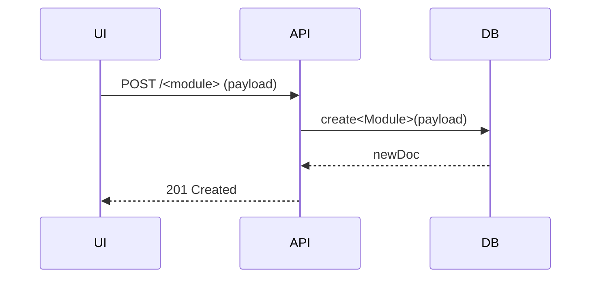
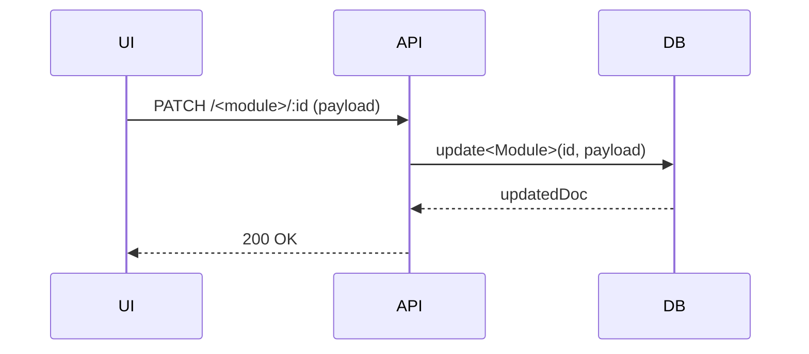

# Expand Low‑Level Design (LLD) for All Modules

## Goal
Create a comprehensive Low‑Level Design document (`docs/LLD.md`) that provides **full coverage** of every backend module (35 total) with the following for each module:
- Brief module description & responsibilities.
- Detailed component breakdown (Controller, Service, Repository/Model, DTOs, Guards, Interceptors, Schemas).
- Sample TypeScript code snippets for key classes/DTOs.
- Complete API table (all CRUD + domain‑specific endpoints) with HTTP method, path, description, and required role.
- **Two Mermaid diagrams** per module: one illustrating the typical *Create* flow and another for the *Update* flow (including validation, service calls, DB interaction, and response).
- Additional visuals for error handling, authentication, and notification flows where relevant.
- `file://` links to every source file referenced.
- Cross‑module relationships (e.g., how `Students` reference `Classes` and `Sections`).

## User Review Required
> **Please confirm** that the outlined level of detail (full component tables, code snippets, two flow diagrams per module, and file links) meets your expectations. If you need more or fewer diagrams, or want to include additional module‑specific flows (e.g., bulk import, scheduled jobs), let us know now.

## Open Questions
- Are there any **custom or experimental modules** not present in the current `backend/src` directory that should be documented?
- Do you want **additional sequence diagrams** for batch operations such as `Attendance import`, `Fee batch processing`, or `Report generation`?
- Should we include a **global diagram** showing interaction between major subsystems (Auth ↔ Users ↔ Notifications ↔ Analytics)?

## Proposed Changes
### 1. Gather Module List
- Run a script (`ls backend/src`) to obtain all 35 module directories.
- For each module, locate the primary files:
  - `*.controller.ts`
  - `*.service.ts`
  - `schemas/*.schema.ts` (or Mongoose model files)
  - `dto/*.dto.ts`
  - Any guard/interceptor files.

### 2. Generate Section Template
For each module, generate a Markdown block following this template (filled with actual file names and snippets):
```markdown
### <Module> Module
#### Internal Components
- **Controller**: `[<module>.controller.ts](file:///.../<module>.controller.ts)`
- **Service**: `[<module>.service.ts](file:///.../<module>.service.ts)`
- **Schema**: `[<module>.schema.ts](file:///.../<module>.schema.ts)`
- **DTOs**: `create-<module>.dto.ts`, `update-<module>.dto.ts`
- **Guards/Interceptors**: (list if present)

#### Sample Schema
```typescript
@Schema({ timestamps: true })
export class <Module> {
  @Prop({ required: true })
  name: string;
  // additional fields …
  @Prop({ type: Types.ObjectId, ref: 'Tenant' })
  tenant: Tenant;
}
```

#### Sample DTOs
```typescript
export class Create<Module>Dto {
  @IsString()
  name: string;
  // …
}
```

#### API Endpoints
| Method | Path | Description | Required Role |
|--------|------|-------------|---------------|
| GET    | `/api/<module>` | List all | ADMIN |
| POST   | `/api/<module>` | Create new | ADMIN |
| GET    | `/api/<module>/:id` | Get details | ADMIN |
| PATCH  | `/api/<module>/:id` | Update | ADMIN |
| DELETE | `/api/<module>/:id` | Delete | ADMIN |

#### Create Flow (Mermaid)


#### Update Flow (Mermaid)

```

### 3. Insert Cross‑Cutting Sections
- Error handling & validation (global filters, DTO validation).
- Security controls (guards, RBAC, rate limiting, audit logging).
- Caching & performance (indexes, pagination, bulk ops, job queue).
- Metrics, health, and analytics overview.

### 4. Assemble Document
- Start with the existing overview table (already present).
- Append the generated module sections in alphabetical order.
- Add a final "Cross‑cutting concerns" section.
- Ensure the total document size remains reasonable (< 150 KB).

### 5. Verify
- Run a quick script to ensure every module listed in the overview has a corresponding section header.
- Open the Markdown preview to confirm all Mermaid diagrams render.
- Validate that all `file://` links resolve.

## Verification Plan
- **Automated**: `npm run lint && npm run build` (no code changes, just docs). 
- **Manual**: Review rendered LLD in VS Code, click a few links, confirm diagrams display.

---

*Please review the plan and answer the open questions. Once approved, we will generate the full LLD content.*
